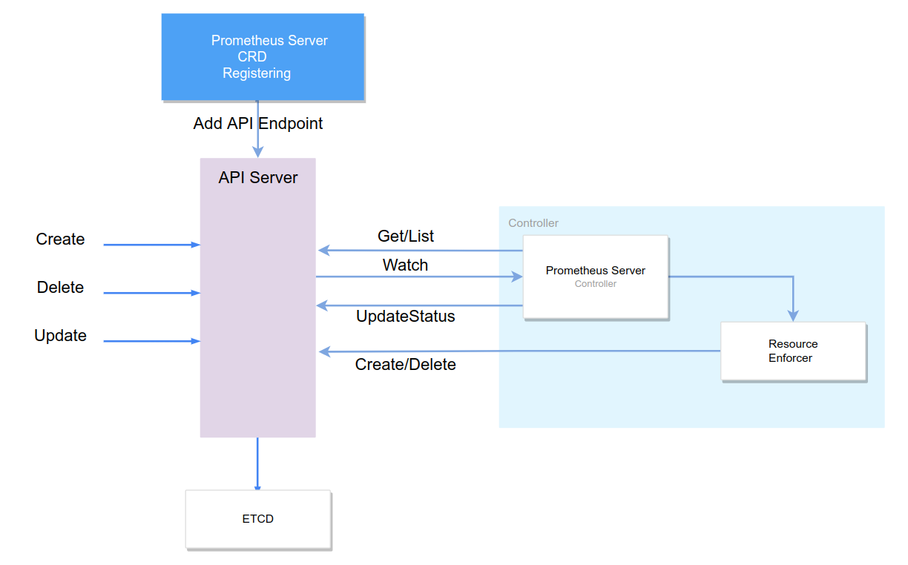
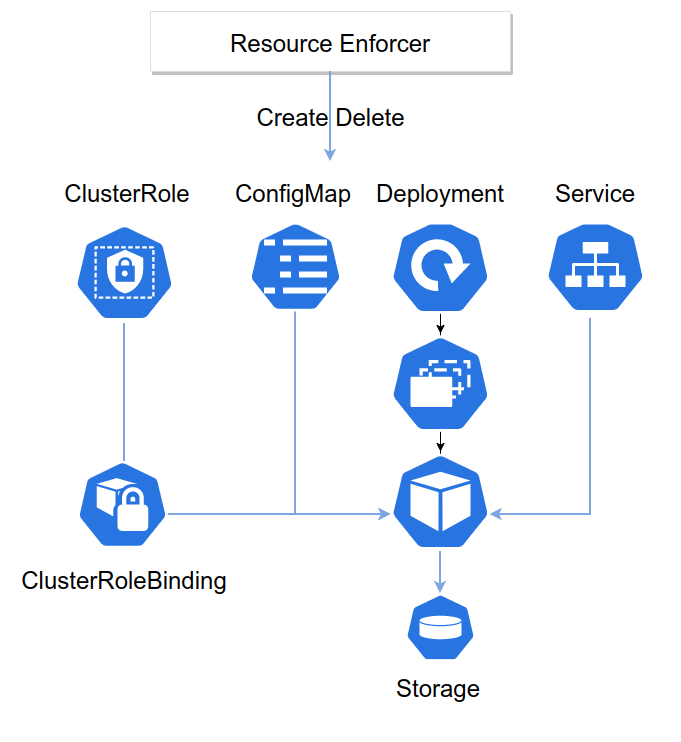
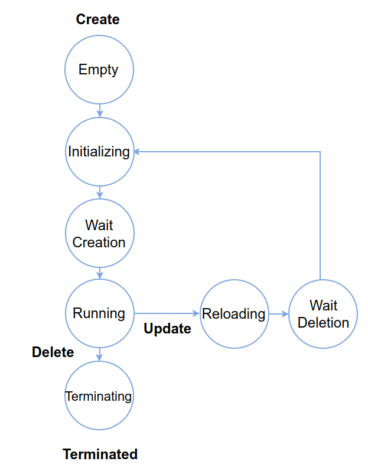

# Prometheus Operator
[](https://github.com/marcosQuesada/prometheus-operator/actions)

## Overview
Prometheus Server deployer operator, it deploys a basic Prometheus Stack at Kubernetes Cluster based on a new CRD called Prometheus Server, which defines Prometheus version and config.

The operator take care in the whole Prometheus Stack lifecycle, ensuring resource creation/deletion executing all required steps.

## Basics
This Operator has been done has a learning exercise, so that, a few trade-offs has been done, as:
- No Controller framework (not yet indeed), it's not using Kubebuilder or Operator-SDK, everything is done from scratch.
  - Why: For the sake of learning how internals works :)

## Current features
- [X] When a Prometheus Custom Resource is submitted to a cluster, the operator should ensure that a matching Prometheus server is created, running inside the cluster.
- [X] The Custom Resource should specify the Prometheus server version.
- [X] The Prometheus server created should scrape metrics from the implemented Kubernetes Operator.
  - [X] The Prometheus server’s scrape configuration should be configurable through the Custom Resource.
- [X] When the Custom Resource is removed, the Prometheus server is removed too.

Apart from those:
- CRD auto register
- Prometheus Operator support for rolling out new Prometheus versions or configs (once they are running, example: upgrade prometheus version)


## Current limitations
A few things feels wrong or incomplete at the end of the first iteration:
- Conciliation loop hardcoded states
  - The concept of 'desired state' is hardcoded in the internals
- No 'Chart's concept, controlled resources are hardcoded too in what's called ResourceEnforcers


As you can see many things can be improved, basically seems that moving to Helm charts is the perfect step, enforcers will be able to get out from resource definition coupling, being able to execute receipts in a generic way.

### Prometheus Server Custom Resource Definition
Includes just 2 fields
- Prometheus version: docker official images at https://hub.docker.com/r/prom/prometheus/tags
- Prometheus config: raw config, no validation is done (one of the improvements points)

Status is handled as CRD Subresource
- CRD state progression events feds the conciliation loop
- Finalizers are used in the creation/deletion step

## Workflow
- The controller watches Prometheus Server CRDs (note that by definition, right now, 1 single CRD is expected in one unique cluster)
- Once a PrometheusServer has been created it will execute the conciliation loop as many times as required until having a full Prometheus Server stack deployed.
- Conciliation loop gets fed from K8s event updates
 
Current model limits the conciliation loop capabilities:
  - Unable to react on status timeouts
  - Fragile behaviour on unexpected situations
  - Segregating the control loop to an external one seems the clear path to win on resilient behaviour.

### Operator Scheme
As a regular operator, Prometheus Server controller watches its own CRD type, reacting to those events applying the conciliation loop.


### Resource Enforcer scheme (Prometheus Server stack)
A vanilla version from Prometheus is used, basically the minimum resource stack



### Conciliation loop detail
Conciliation loop hardcode the 'Desired State' which is Running until a CRD termination signal is received, moment where CRD desired state is Terminated.

Implementation is polarized by FSM typical design, events are submitted to the FSM advancing its state and changing its behaviour.



Prometheus Server Spec Updates are handled as full scheme redeploy, to allow that, from running it transitions to Reloading state, destroying all resources and then jump back to initialize all resources again.

This behaviour is quite basic indeed, and can be improved getting more detail about CRD update. On detail:
- on Prometheus version change the procedure would be:
  - recreate Deployment resource pointing the new Prometheus Image version. Once completed rollout is done
- on Prometheus config change
  - recreate ConfigMap with the new configuration
  - reload Prometheus Server can be done without instance restart using /-/reload endpoint
  


## Further Iterations
Many improvements can be done:
- Kubebuilder: moving to standard code means dedicating time to our core business, in that case resilient controller
- Conciliation Loop Improvements: timeout by state detection, react to them
- Admission Webhook: this will limit and validate incoming CRDs (total CRD allowed number, validate Prometheus config before apply)
- Help charts usage, this probably will move the project to a generic system that it just deploys charts and conciliates them

## Operator commands
Project developed using Cobra cli, two entry points:
  - external: Allows external Kubernetes connectivity, useful for development purposes.
  - internal: Uses K8s internal client, the one to use to build real containers
  
### Running on local
You can run the controller locally using the external cmd which is really useful while on development
```
make external
```

## Development procedures
API CRD generation:
```
make generate-crd
```

Build Docker as:
```
make build-docker

```
Run test suite and generate testing coverage
```
make test-all
```

### Deployment procedures:
All receipts are developed with Minikube, a few limitations are there, as ImagePullPolicy: Never which is really useful for development.
On a dev/prod scenarios update manifest to a real behaviour.

```
kubectl apply -f k8s/namespace.yaml
kubectl apply -f k8s/rbac.yaml
kubectl apply -f k8s/controller.yaml
```

Once done Prometheus Server CRD is registered in the cluster and our Operator will be watching it.
```
kubectl get crd
NAME                                 CREATED AT
prometheusservers.k8slab.info        2022-05-05T12:06:56Z
```

### Give it a try!

#### Prometheus Server creation 
Let's deploy a PrometheusServer crd (k8s folder:
```
kubectl apply -f k8s/prometheus-server-example.yaml
```
Monitoring prometheusServer crd: 
```
kubectl get prometheusserver -w
NAME                VERSION   AGE     STATUS
prometheus-server   v2.35.0   0s      
prometheus-server   v2.35.0   0s      
prometheus-server   v2.35.0   0s      INITIALIZING
prometheus-server   v2.35.0   0s      WAITING_CREATION
prometheus-server   v2.35.0   0s      RUNNING

```
Event Recorder will emit some events from the conciliation loop:
```
kubectl get ev -w
LAST SEEN   TYPE     REASON             OBJECT                               MESSAGE
94s         Normal   createAllSuccess   prometheusserver/prometheus-server   resources created with success
94s         Normal   Running            prometheusserver/prometheus-server   Prometheus Server Namespace default Name prometheus-server running
```

In the current Prometheus Vanilla stack defined by the resource enforcer there is a service which we will need to port forward to open prometheus:
```
kubectl port-forward service/prometheus-server-service 8080 -n monitoring
```
So now, let's open a browser on http://localhost:8080/ to access finally the deployed Prometheus Server.

#### Prometheus Server deletion 
```
kubectl delete prometheusserver prometheus-server
```
Monitoring prometheusServer crd we will see:
```
kubectl get prometheusserver -w
NAME                VERSION   AGE     STATUS
prometheus-server   v2.35.0   9m18s   RUNNING
prometheus-server   v2.35.0   9m18s   TERMINATING
prometheus-server   v2.35.0   9m18s   TERMINATING
```
Deletion is reflected as events too:
```
kubectl get ev -w
LAST SEEN   TYPE     REASON             OBJECT                               MESSAGE
40s         Normal   Terminated         prometheusserver/prometheus-server   Prometheus Server Namespace default Name prometheus-server Terminated
```
#### Prometheus Server update
Right now the controller is quite weak in terms of observing changes in the Prometheus Server crd, but generation is tracked, so that, version updates are handled as full rollout cycle,
destroying current monitoring environment and redeploying back again.

This behaviour can be tested changing version or config (k8s/prometheus-server-example.yaml), as an example, if we change Prometheus Server version from v2.35.0 to v2.34.0 
the update will be handled by the controller:
```
kubectl get prometheusserver -w
NAME                VERSION   AGE     STATUS
prometheus-server   v2.34.0   14s     RUNNING
prometheus-server   v2.34.0   14s     RELOADING
prometheus-server   v2.34.0   14s     WAITING_REMOVAL
prometheus-server   v2.34.0   14s     INITIALIZING
prometheus-server   v2.34.0   14s     WAITING_CREATION
prometheus-server   v2.34.0   14s     RUNNING

```
```
kubectl get ev -w
LAST SEEN   TYPE     REASON             OBJECT                               MESSAGE
0s          Normal   Running            prometheusserver/prometheus-server   Prometheus Server Namespace default Name prometheus-server running
0s          Normal   Reloading          prometheusserver/prometheus-server   Prometheus Server Namespace default Name prometheus-server reloading
0s          Normal   Rebuilding         prometheusserver/prometheus-server   Prometheus Server Namespace default Name prometheus-server rebuilding
0s          Normal   createAllSuccess   prometheusserver/prometheus-server   resources created with success
```
## Definitions
### Environment vars
- WORKERS: total workers consuming operator events queue
- RESYNC_INTERVAL: Shared informer resync period
- LOG_LEVEL: Logging level detail
- ENV: reflects deployment environment
- HTTP_PORT: Operator exposed http port
  - /metrics reports operator metrics
  - /healthz reports Release version Date and Hash Commit. Liveness probe endpoint
